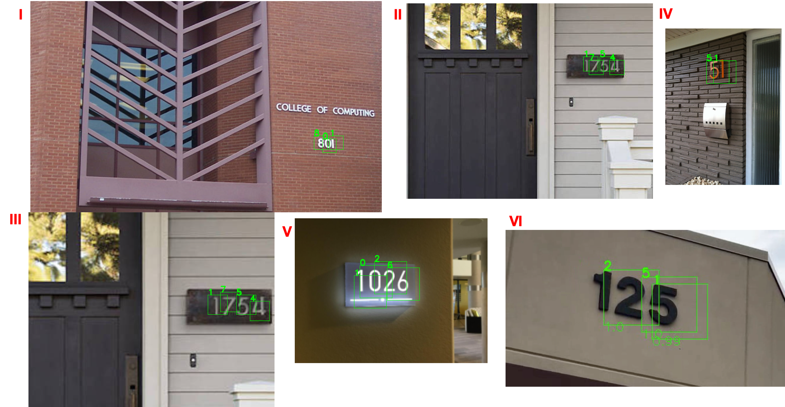

# Classification and Detection with Convolutional Neural Networks

This project is aiming to use different Convolutional Neural Network based methods: CNN, VGG16 with pretrained weights, and VGG16 from scratch, to detect digits in given street house images. And the images/digits used for test purpose in this project has different scale, fonts, positions, orientation, light conditions, noise conditions. The model was trained through Tensorflow GPU on university's scluster and only need to run one function python code for the detection process.

### How to run

build conda environment:

conda env create -f cv_proj.yml
conda activate cv_proj
python run.py

### Files

* [Function code (Python)](https://github.com/chd415/Computer-Version/blob/master/Motion-Detection/ps4.py)

* [Project report](https://github.com/chd415/Computer-Version/blob/master/Motion-Detection/ps4_report.pdf)

### Results Example

* Model architecture

* Images with correct/incorrect detection

* [Digit detection on video](https://www.dropbox.com/s/w9oahxx9e0ev0vp/output.mp4?dl=0)

* [Presentation of work](https://www.dropbox.com/s/q5gf0xuawraeagk/presentation.mp4?dl=0)

