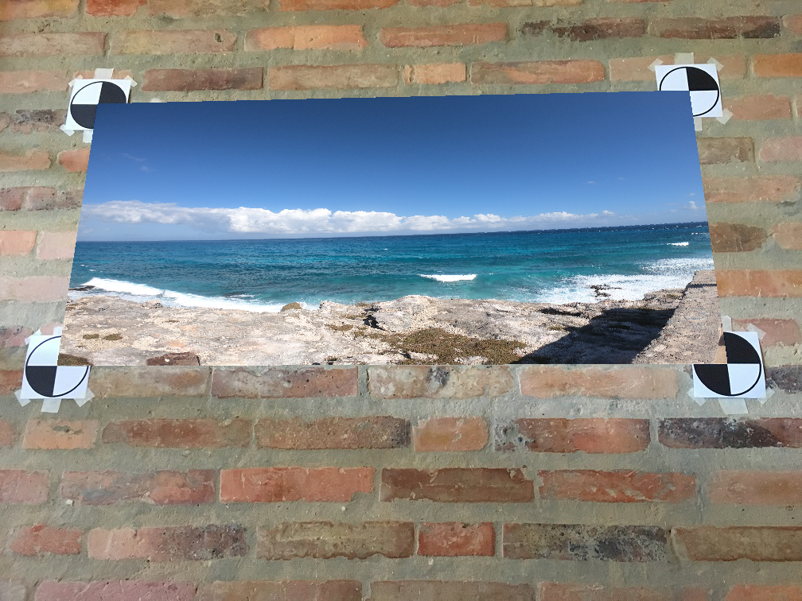

# Introduction to Augmented Reality

This project is aiming to solve the marker recognition problem with/without noise in the scene. And apply the solving method to images/videos. Finally will end up with inserting a video within the base video using projective geometry and image warping techniques.

### Files

* [Function code (Python)](https://github.com/chd415/Computer-Version/blob/master/Introduction-to-AR/ps3.py)

* [Driver code (Python)](https://github.com/chd415/Computer-Version/blob/master/Introduction-to-AR/experiment.py)

* [Project report](https://github.com/chd415/Computer-Version/blob/master/Introduction-to-AR/ps3_report.pdf)

### Results Example

* [insert image into base image]

* [insert image into base video](https://www.dropbox.com/s/pq8q4udctr30h44/ar_5-a-ps3-4-a.mp4?dl=0)

* [insert video into base video](https://www.dropbox.com/s/t8mxltdzpokspd0/ar_6-a-ps3-4-a.mp4?dl=0)

